<div align="center">

# Floating Observatory

### Focus sessions that grow a living 3D island

**Pomodoro · Island builder · Streaks · Crew · Sealed saves · PWA**

A deep-work game for **desktop and phone**: complete timed focus quests, earn crystals & energy, place and upgrade structures on a floating island, and come back tomorrow for streak bonuses.

[](https://nextjs.org/)
[](https://react.dev/)
[](https://threejs.org/)
[](https://www.typescriptlang.org/)
[](./LICENSE)
[](https://github.com/ArdaDDemir)

*No backend · No account · Progress lives in your browser*

**Author:** [ArdaDDemir](https://github.com/ArdaDDemir) · **Repo:** [floating-observatory](https://github.com/ArdaDDemir/floating-observatory)

</div>

---

## Why this exists

Most Pomodoro timers are a countdown and a beep.  
**Floating Observatory** turns focus into a place you maintain:

| Loop | What happens |
|------|----------------|
| **Focus** | Start 5–60m quests (or custom). Ambient events drip small rewards mid-session. |
| **Build** | Spend crystals & energy on towers, labs, shields, signal dishes. |
| **Return** | Daily goals grow streaks. Miss a day → soft comeback gift. Fail → penalty, not a wipe. |

Built as a **portfolio-ready web game**: polished UI, mobile shell, offline PWA, and clean code you can fork.

---

## Features

<table>
<tr>
<td width="50%">

### Focus engine
- Custom durations + presets  
- Pause / resume / abandon with fair penalties  
- Tags (coding, study, deep work…)  
- Ambient focus events + minute ticks  
- Break mode + zen HUD  
- Full procedural SFX (start, pause, complete, fail…)  

</td>
<td width="50%">

### Island & meta
- 5 building types · CoC-style visual tiers  
- **Tap a building** → upgrade / relocate / destroy  
- **Tap a crew NPC** → assign a work post  
- 7 crew roles · roster grows 2→12 with level  
- Research, cosmetics, achievements, journal  

</td>
</tr>
<tr>
<td width="50%">

### Technical craft
- React Three Fiber island + post FX  
- Zustand + sealed localStorage (integrity hash)  
- Anti-tamper meteor “justice”  
- Graphics Auto / Low / High  
- **Royalty-free Web Audio** (no sample packs)  

</td>
<td width="50%">

### Ship-ready UX
- Desktop + phone + landscape  
- PWA + offline shell (production)  
- Wake lock + haptics  
- Sealed export / import  

</td>
</tr>
</table>

---

## Sound (royalty-free)

All audio is **generated at runtime** with the Web Audio API — no MP3/WAV assets, no third-party packs.

| Area | Examples |
|------|----------|
| Session | Start, pause, resume, complete, daily goal, fail, lockout |
| Focus | Event loot / flavor, minute tick, halfway, final stretch |
| Island | Place, upgrade, destroy, relocate, build mode on/off |
| Crew | Select NPC, assign post, new recruit join |
| UI / meta | Research, achievement, toggles, export/import, meteor |

Toggle in **Settings → Sound cues** (on by default).

---

## Quick start

**Requirements:** Node.js 20+ recommended, npm 10+

```bash
git clone https://github.com/ArdaDDemir/floating-observatory.git
cd floating-observatory

# install
npm install

# develop
npm run dev
```

Open **[http://localhost:3000](http://localhost:3000)**

```bash
# production (enables service worker / offline shell)
npm run build
npm start
```

Deploy anywhere that runs Next.js (Vercel one-click works great):

[](https://vercel.com/new)

---

## Controls

| Input | Action |
|-------|--------|
| **Space** | Pause / resume focus |
| **B** | Toggle build mode (place tray) |
| **M** | Open Lab (meta) |
| **Z** | Zen mode |
| **Esc** | Close panels / clear selection |
| **Click building** | Open upgrade / manage card |
| **Click NPC** | Assign crew to a building post |
| **Touch** | 1 finger orbit · 2 finger zoom · tap to place / select |

---

## Project structure

```text
src/
├── app/                 # Next.js App Router (layout, PWA icons, manifest)
├── components/
│   ├── Scene.tsx        # R3F canvas, island, lights, orbit
│   ├── GameHUD.tsx      # Main UI: timer, build, resources
│   ├── buildings/       # Per-type 3D models
│   └── …panels          # Settings, Lab, Guide, Stats
├── store/useGameStore.ts# Game state, economy actions, persist
├── lib/
│   ├── gameConfig.ts    # Costs, rewards, fail math  ← tweak economy
│   ├── meta.ts          # Streaks, research, achievements
│   ├── events.ts        # Ambient focus events
│   ├── crew.ts          # Crew roles & buffs
│   ├── save.ts          # Sealed save v3 + hash
│   └── perf.ts          # Graphics profile / mobile scale
├── hooks/               # Mobile, wake lock, graphics, hotkeys
public/
├── sw.js                # Offline shell service worker
└── offline.html
```

---

## Docs

| Doc | What’s inside |
|-----|----------------|
| **[docs/GUIDE.md](./docs/GUIDE.md)** | Player-facing systems overview |
| **[docs/CUSTOMIZING.md](./docs/CUSTOMIZING.md)** | Change economy, buildings, events, branding |
| **[docs/ARCHITECTURE.md](./docs/ARCHITECTURE.md)** | Data flow, save seal, render pipeline |
| **[CONTRIBUTING.md](./CONTRIBUTING.md)** | Local workflow & PR notes |

---

## Tech stack

- **[Next.js 16](https://nextjs.org/)** App Router · React 19  
- **[React Three Fiber](https://docs.pmnd.rs/react-three-fiber)** + Drei + postprocessing  
- **[Zustand](https://zustand-demo.pmnd.rs/)** + persist (sealed)  
- **[Framer Motion](https://www.framer.com/motion/)** · Tailwind CSS 4 · Lucide icons  

> Note: this repo’s Next version may differ from older tutorials. Prefer the docs under `node_modules/next/dist/docs/` when extending framework APIs.

---

## Customize in 60 seconds

```ts
// src/lib/gameConfig.ts
export const STARTING_CRYSTALS = 150;
export const STARTING_ENERGY = 150;

// Rewards ≈ minutes × 1.05 (see rewardsForDuration)
// Building costs live in BUILDINGS record
```

```ts
// src/lib/meta.ts — streak multipliers, research costs, daily goal default
export function streakRewardMultiplier(currentStreak: number) { … }
```

Full map of knobs: **[docs/CUSTOMIZING.md](./docs/CUSTOMIZING.md)**

---

## Screenshots

Real captures from the running app (Playwright · regenerate with `npm run screenshots`).

### Desktop

<p align="center">
  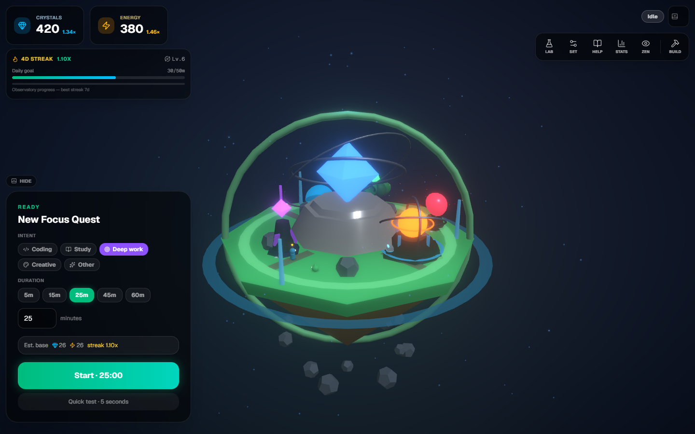
</p>

<p align="center"><em>Idle hub — resources, streak, tags, duration presets, full 3D island</em></p>

| Focus session | Build mode |
|---------------|------------|
| 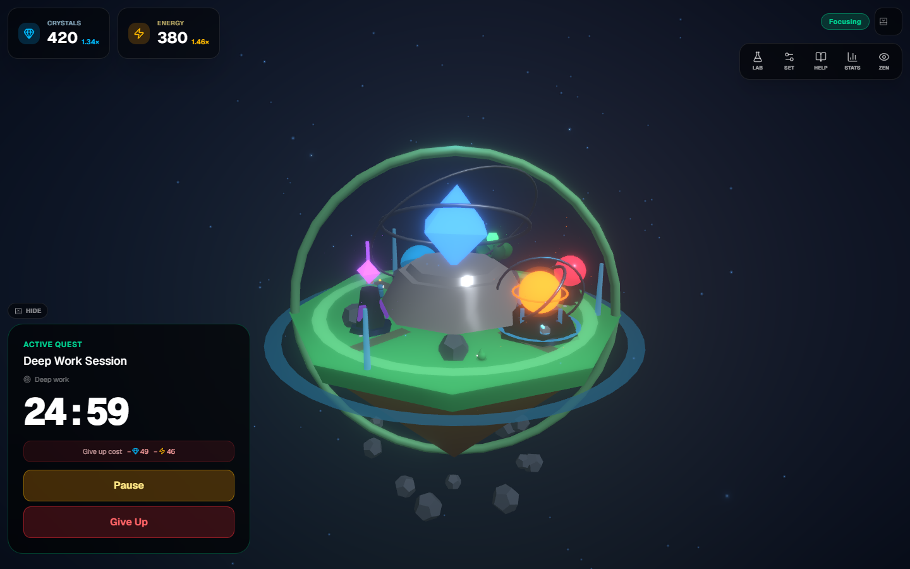 | 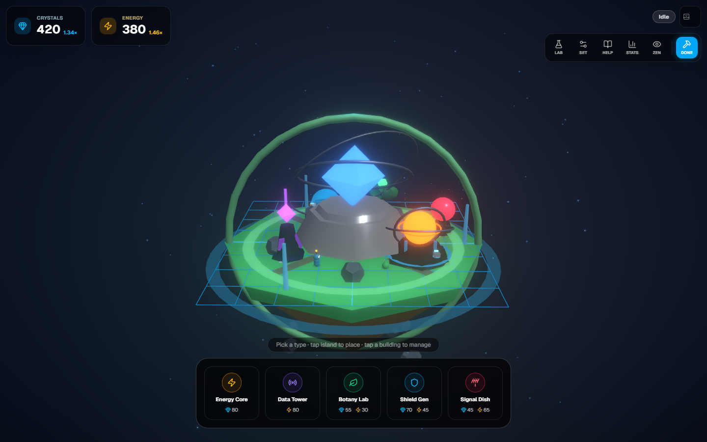 |

| Building picker detail | Field manual |
|------------------------|--------------|
| 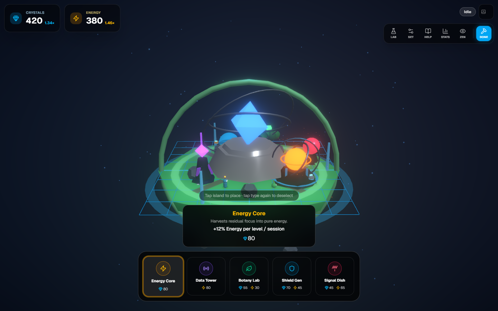 | 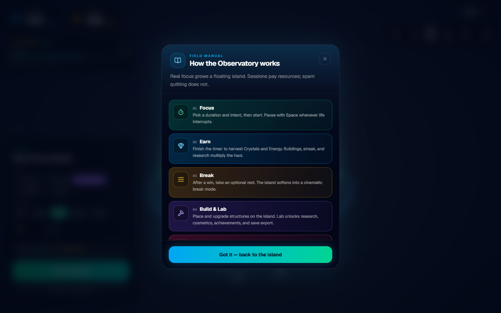 |

| Lab research | Paused session |
|--------------|----------------|
| 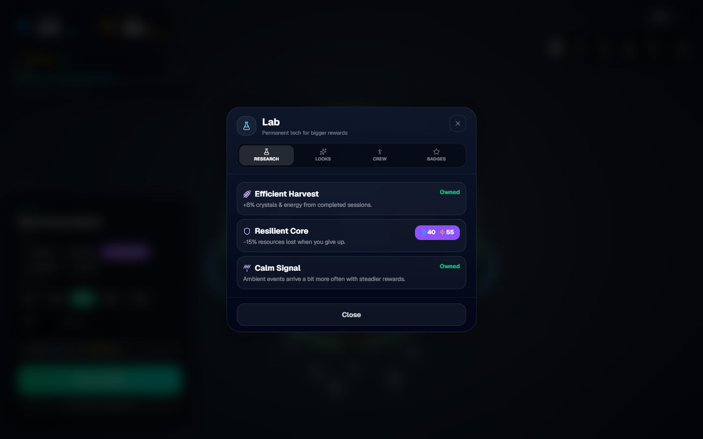 | 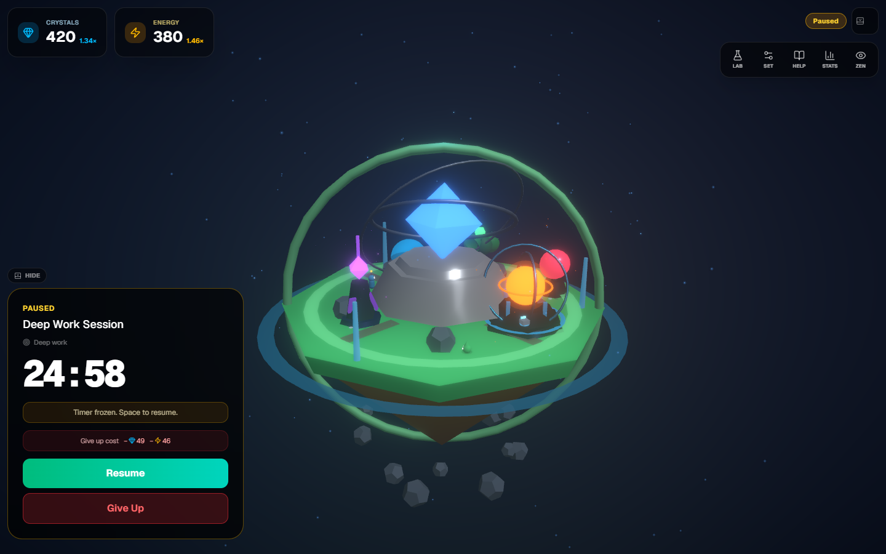 |

### Mobile

| Island (compact chrome) | Quest sheet |
|-------------------------|-------------|
| 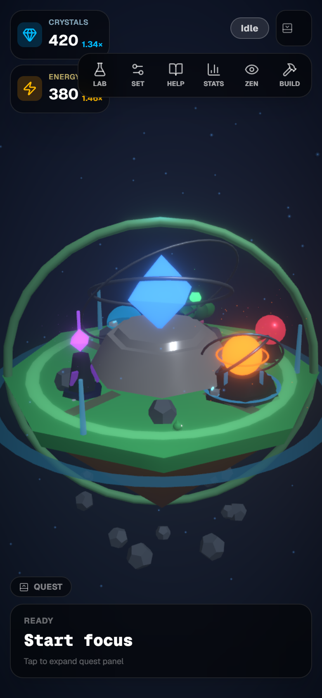 | 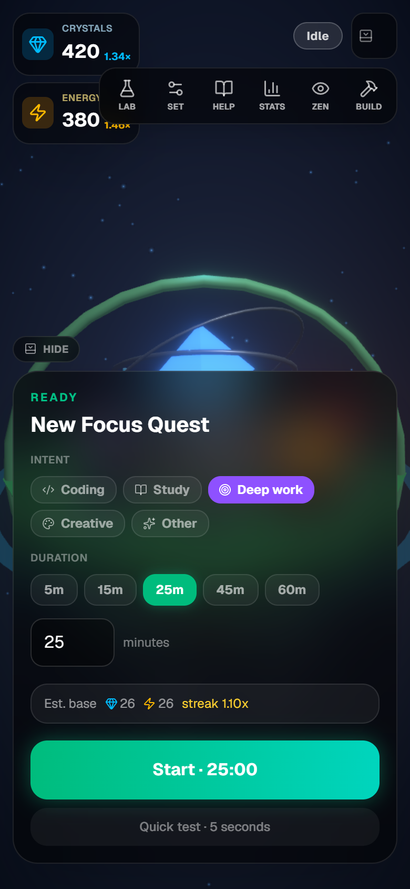 |

| Focus timer | Settings (bottom sheet) |
|-------------|-------------------------|
| 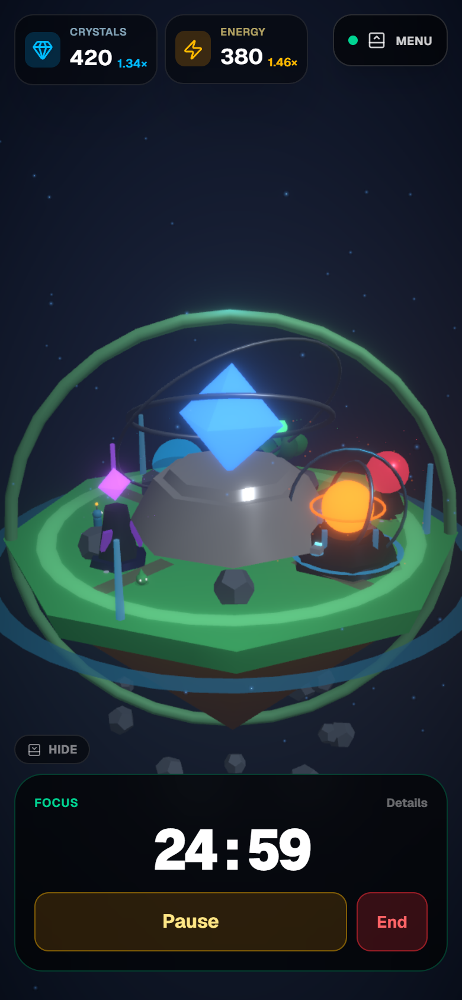 | 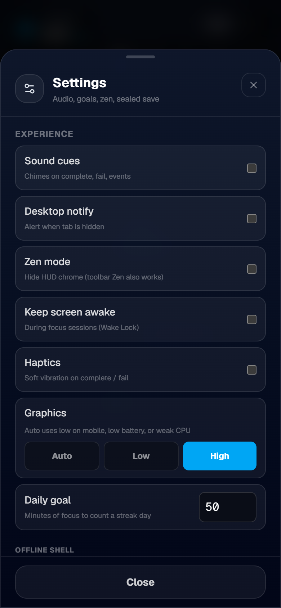 |

### Tablet / landscape

<p align="center">
  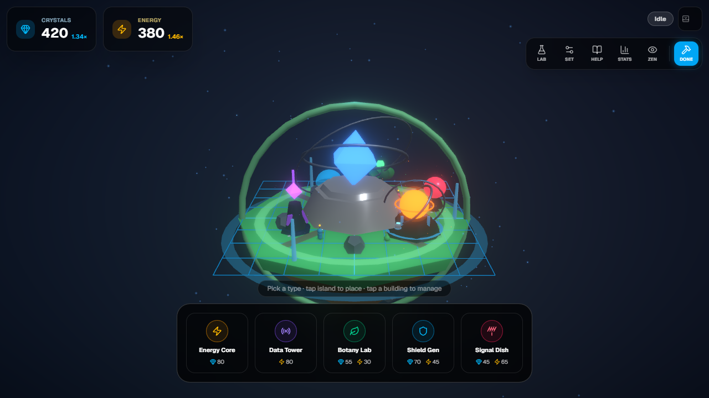
</p>

### Buildings at a glance

Five placeable structures appear on the island and in the build tray:

| Building | Role |
|----------|------|
| **Energy Core** | +% energy from sessions |
| **Data Tower** | +% crystals from sessions |
| **Botany Lab** | Dual small bonus |
| **Shield Gen** | Softens fail penalties |
| **Signal Dish** | Stronger ambient event loot |

See the build tray screenshot above for costs and icons.

### Crew roles (grow with observatory level)

| Role | Buff when assigned |
|------|--------------------|
| Worker | Cheaper upgrades |
| Gardener | Botany Lab bonus |
| Scout | Better event loot |
| Engineer | Energy Core / shield energy |
| Caretaker | Extra fail mitigation |
| Archivist | Data Tower crystals |
| Courier | Small dual bonus on any post |

Start with **2** crew · unlock up to **12** as the observatory levels.

---

## Roadmap ideas (fork-friendly)

- [ ] Cloud optional sync (still local-first)  
- [ ] Shared island cosmetics packs  
- [ ] Soundscape packs per tag  
- [ ] Steam / Capacitor shell (same web core)  

PRs and stars appreciated ⭐

---

## License

MIT — see [LICENSE](./LICENSE).  
Built by [**ArdaDDemir**](https://github.com/ArdaDDemir) as a focus toy and a code showcase. Go ship your own island.
